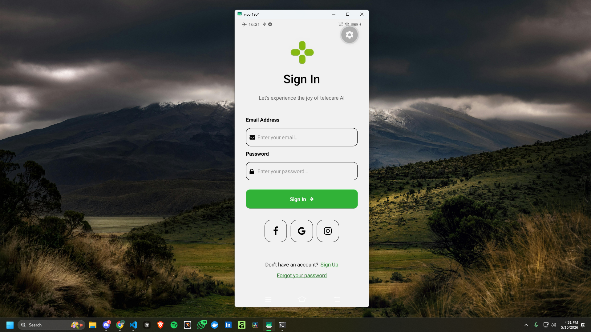
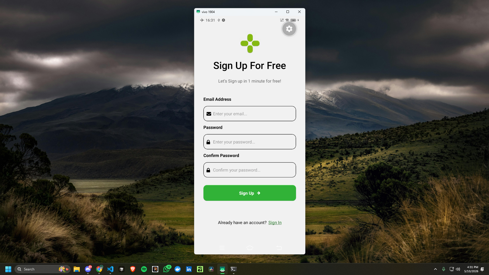
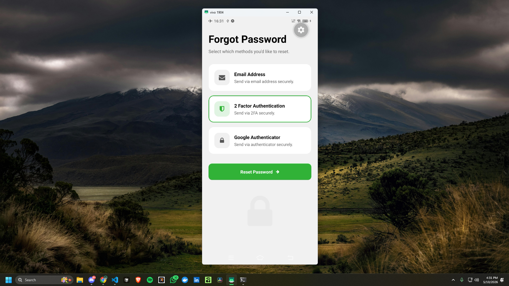

# Sign In & Sign Up UI

A mobile UI prototype built with Expo and React Native for sign in, sign up, and forgot password flows.

## Screenshots

### Sign In Screen


### Sign Up Screen


### Forgot Password Screen


## Getting Started

1. Install dependencies:

```bash
bun install
```

2. Start the Expo project:

```bash
bunx expo start
```

3. Open the app in an emulator or on a device.

## Project Structure

- `src/app/` – main screens and navigation layout
- `src/components/` – reusable UI components
- `assets/` – image assets and icons

## Notes

This project is designed as a UI demo for authentication screens and does not include backend authentication logic.
